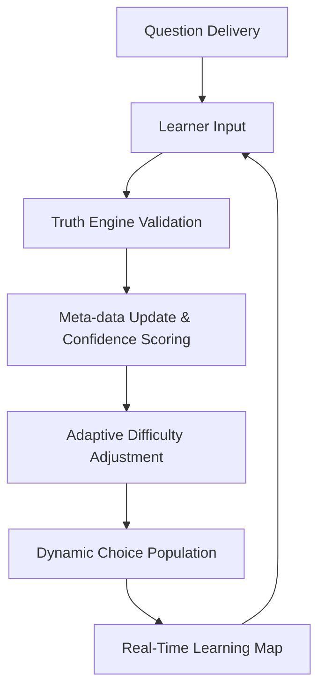
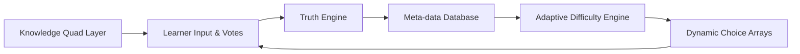

# Universal Educator Design Document

---

# Introduction

**Purpose:** This system is a self-propelled universal educator designed to dynamically deliver, validate, and adapt knowledge for learners in real time.

**Scope:** Covers knowledge representation, learner interaction, adaptive difficulty, truth validation, and real-time learning mapping.

**Objectives:**

- Autonomous curriculum generation and validation
- Real-time learning tracking and pathway adaptation
- Learner-driven curation integrated with automated verification

---

# System Overview
[newline]
# Data Vetting and Organization
[newline]
## Function Notes: Distinguishing Objectives vs. Content

To automate classification, the system uses the following logic:

**Objectives**
- Structured as categories, topics, subcategories, or skills to be learned
- Often use verbs like "Understand," "Identify," "Describe," "Explain," "List," "Recognize," "Apply," "Distinguish," "Demonstrate"
- Hierarchical structure (e.g., XML tags like <Topic>, <SubCategory>, <BigIdea>, <Concept>)
- Rarely include detailed explanations, definitions, or citations

**Content**
- Provides factual information, definitions, explanations, examples, or resources
- Includes <Definition>, <Citation>, <WebResources>, or detailed text
- Not structured as a learning goal, but as material to be learned

**Sample Function Logic:**
1. Check for objective indicators (tags, verbs, structure)
2. Check for content indicators (definitions, citations, resources)
3. Fallback: Analyze text for verbs/goals

This logic enables automated vetting and organization of incoming data for curriculum generation and adaptive learning.

## Data Categories

To ensure robust curriculum generation and adaptive learning, all incoming data is classified as one of two essential categories:

1. **Teaching Standards/Objectives**
    - Examples: AP CSP Objectives, ICS Comp Fund, IC3 Key Apps, New Pers CSD (objectives/tasks)
    - Purpose: Define what should be taught, learned, or assessed. Used for curriculum design, benchmarks, and vetting questions.

2. **Instructional Content**
    - Examples: Computer Science Terminology.csv, Post_Course_Concept_Summary.md, textbooks, lesson plans, factual statements
    - Purpose: Provide the actual material, explanations, examples, and facts used for teaching. Used for knowledge cards, question generation, and learning activities.

## Integration Workflow

* Standards/objectives guide the vetting and selection of instructional content.
* Instructional content is mapped to standards to ensure coverage and relevance.
* The Truth Engine and Adaptive Difficulty Engine validate and refine both categories in real time.
* Both categories are essential for building a modular, standards-driven Universal Educator system.

## Core Components

1. **Knowledge Quad Layer**: Each question with 4 dynamic options + typed answer; 4 static options (Extend, Expand, Explore, Review).
2. **Truth Engine**: Validates answers using online corroboration, assigns confidence scores.
3. **Adaptive Difficulty Engine**: Adjusts difficulty based on learner votes and interactions.
4. **Meta-data Driven Database**: Stores knowledge quads, confidence scores, subject layers, learner pathways.
5. **Real-Time Learning Mapper**: Maps learner choices and pathways as learning occurs.

---

# Data Structures

## Knowledge Quad

```json
Quad {
    question_id,
    subject_layer,
    difficulty_level,
    dynamic_options[4],
    static_options: {Extend, Expand, Explore, Review},
    meta_data: {confidence_score, pathway_links, last_updated}
}
```

## Learner Interaction Record

```json
Interaction {
    learner_id,
    quad_id,
    selected_option,
    typed_answer,
    timestamp,
    vote (Extend/Review/etc.),
    resulting_difficulty_change
}
```

## Truth Engine Output

```json
FactValidation {
    statement_fragment,
    confidence_score,
    sources_found,
    safe_for_education: boolean
}
```

---

# Workflows

1. **Question Delivery**: system presents a quad to the learner.
2. **Learner Input**: selects option or types answer; votes on perceived difficulty.
3. **Truth Engine Validation**: typed input is broken into fragments, searched online, assigned a confidence score.
4. **Difficulty Adaptation**: Extend/Review votes adjust future quad difficulty for the learner cohort.
5. **Pathway Mapping**: database updates meta-data, maps learner trajectory in real time.
6. **Dynamic Choice Population**: soft-coded curators adjust next quads based on validated knowledge and learner choices.

---

# Adaptive Mechanisms

- **Difficulty Self-Adjustment**: Weighted by learner votes and historical performance.
- **Knowledge Evolution**: New pathways integrated automatically if ≥3 data sources and ≥80% confidence.
- **Learner-Driven Curation**: Votes and typed input refine content accuracy and confidence.

---

# Real-Time Learning Map

- **Purpose**: Visualize and record ongoing learning interactions.
- **Capabilities**:
  - Track learner progress through subject layers
  - Show adaptive difficulty changes
  - Map pathways taken, including divergence (Explore) or reinforcement (Review)
  - Aggregate cohort-level learning patterns for meta-analysis

---

# Safety and Reliability

- **Confidence Thresholds**: content <80% confidence withheld.
- **Undo / Safe Sandbox Environments**: prevent data loss during accidental actions.
- **Monitoring Critical Metrics**: detect abnormal activity, microsleeps, or interaction anomalies.

---

# Future Extensions

- AI-assisted personalization beyond current vote/difficulty system.
- Cross-layer meta-analysis to suggest curriculum refinements.
- Historical learning analysis for pedagogy research.

---

# Diagrams / Flowcharts





